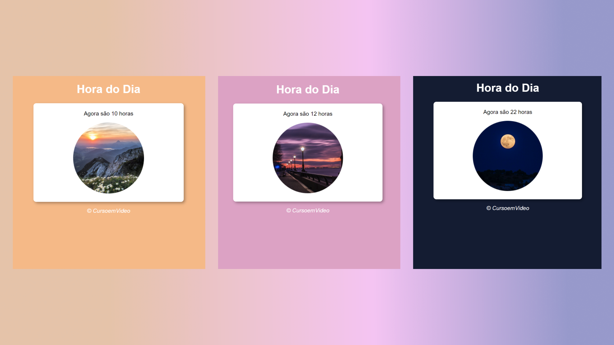

<h1 align="center"> DevLinks </h1>

Exercicio feito com o professor Guanabara do Curso em Video

 

  

## 🚀 Tecnologias

Esse projeto foi desenvolvido com as seguintes tecnologias:

- HTML e CSS
- JavaScript
- Git e Github
- Figma

## 💻 Exercicio

O exercicio feito aqui em Hora do Dia é para treinar javascript principalmente. Usa-se uma função para que puxe a hora do dispositivo que está acessando o site e de acordo com a hora do dia a cor do fundo, a imagem e a hora serão modificados.
